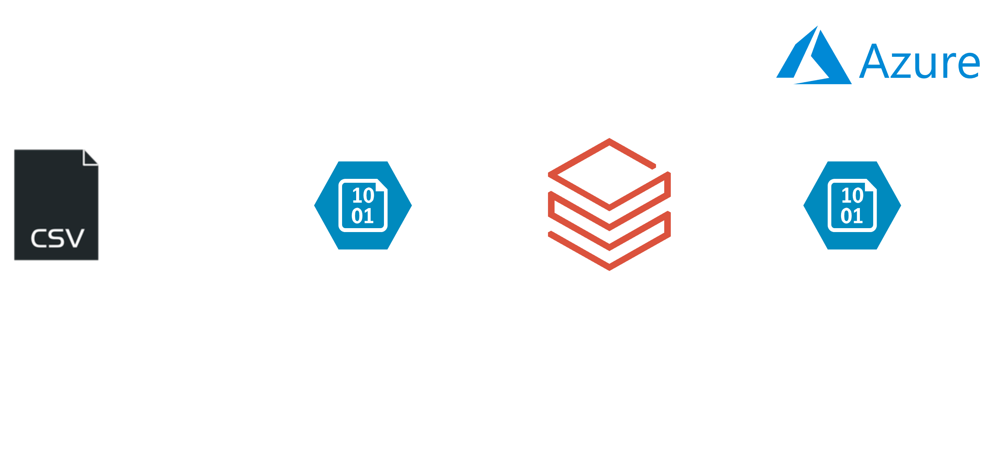
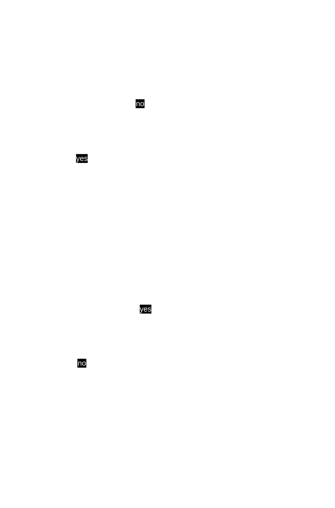

## 1. Project Overview
- Project Name: Clean and load ai-jobs files.
- Project Description: This project is to extract, transform and load an 'ai-jobs' file. This ETL pipeline will be create on Azure, using Azure Databricks and Azure Blob Storage.

## 2. About
### Data Sources
[Polish job offers at AI](https://www.kaggle.com/datasets/michau96/polish-job-offers-at-ai) dataset by Michal Bogacz.

### Project Assumptions
1. Source file is placed every day on an Azure Blob Storage by an external company.
2. File Type is .csv
3. Frequency is daily

### Business Requirements
1. date: Add date column
2. location: If more than 1 location is present, change location to "Multiple"

### Data Quality Checks
1. null: Drop null rows (even if only one cell is null)
2. row retention: file must contain min. 50% of its original rows after all processing (i.e. if source file had 1000 rows, but after transformation 600 got removed, row retention is 40%. File will not be transformed.) 

### Target Systems
Azure Blob Storage.

## 3. Architecture
### High-level Architecture

### Transformation logic
Files will land in different folders based on data quality checks happenning inside the databricks job. See the diagram to understand the flow of data.

### Technologies Used

| **Technology**                 | **Used For:**                                                        |
|--------------------------------|----------------------------------------------------------------------|
| Azure Blob Storage             | storing raw and transformed files                                    |
| Azure Databricks (and Pyspark) | transforming, scheduling and inputting files into Azure Blob Storage |

## 4. Step-by-Step Guide
### Prerequisites:
- Azure Free Trial
- Azure Storage
- Azure Databricks (free 14-day trial)
### Configuration:
1. Set up Azure Storage
2. Set up Databricks:
   1. Create Notebook
   2. Adjust the variables
   3. Test run the notebook
   4. Schedule a job to execute the notebook daily
### Good to know
1. Create small-size machines for this project, so you don't use up your 200$ free budget.
2. Set Azure Databricks to terminate after 30mins of inactivitiy. You'll save on VM costs.